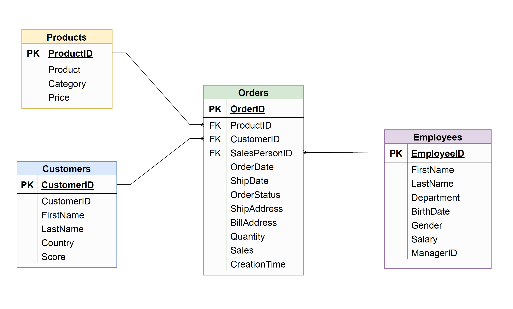

# SQL Practice Tracker

**🔗 Live site: https://sql-tracker-steel.vercel.app**

A personal, static website to track the LeetCode Database (SQL) problems you're practicing.
No framework, no build step, no dependencies — just plain HTML/CSS/vanilla JS. All progress is
stored in your browser's `localStorage`, with optional sync to a private GitHub repo.



## Running it

Either:

- **Open directly** — double-click `index.html` (works from `file://`), or
- **Serve the folder** (recommended, avoids any browser file:// quirks):

  ```bash
  python3 -m http.server 8000
  # then open http://localhost:8000
  ```

## Features

- **105 seeded problems** with pre-marked progress.
- **Group by Difficulty or Topic**, collapsible sections with `solved / total` counts.
- **Overall progress** bar + per-difficulty counts.
- **Search** (id or title) and **filters** (difficulty / topic / status).
- **Per-question tracking**: status (Todo / Attempted / Solved), free-text notes, and a
  monospace SQL-solution editor. Date solved is set automatically the first time you mark
  a problem **Solved**.
- **Daily 5** — 5 of your **currently-unsolved** (Todo) problems, chosen once per day and then
  **frozen**: it never includes anything you've already solved, and solving one today keeps it in
  the set (shown as ✓ done, with an "X/5 solved" counter) instead of reshuffling. The chosen set is
  **synced through the gist**, so every device shows the same Daily 5. Each row has a **✓ Solve**
  button (unlock required). Recomputed when the date rolls over.
- **Daily 5 speed timer** — hit **▶ Start**, **⏸ Pause** / **▶ Resume** whenever you need a break
  (only active time counts), then **■ Stop** to record your time and how many you finished (it also
  auto-stops if you clear all 5). Shows e.g. `⏱ 1:08:13 · 3 solved`; **↺** resets. Times **sync
  across devices** (through the same gist) and feed the **Daily 5 speed** chart in Analytics (best,
  average, and a per-day trend, count on hover).
- **🎲 Random practice** — a separate card that jumps to a random unsolved problem, **never one
  of today's Daily 5**. It clears filters, opens that row, and scrolls to + flashes it.
- **Analytics tab** — a GitHub-style activity **heatmap**, solved-over-time line chart,
  breakdowns by difficulty and topic, current streak, total solved, completion %.
  All charts are hand-drawn inline SVG.
- **PIN edit lock** — view-only by default; unlock to edit.
- **Optional GitHub sync**.

## Files

| File | Purpose |
|------|---------|
| `index.html` | Markup shell + modals |
| `styles.css` | Dark theme, green accent, `@font-face` |
| `questions.js` | The `QUESTIONS` seed array (edit this to add problems) |
| `progress.js` | Committed `PUBLISHED_PROGRESS` snapshot (shared baseline + encrypted token) |
| `storage.js` | `localStorage` persistence + snapshot/merge, keyed by `id` |
| `app.js` | List view, grouping, filters, PIN lock, question of the day, wiring |
| `analytics.js` | SVG charts + stats |
| `sync.js` | Cloud sync: one Gist auto-resolved by filename, PIN-encrypted token |
| `fonts/` | Self-hosted Comic Shanns + Comic Shanns Mono |

## Adding questions

Append objects to the `QUESTIONS` array in [`questions.js`](questions.js):

```js
{ id: 9999, title: "My New Problem", difficulty: "Medium", topic: "Window",
  url: "https://leetcode.com/problems/my-new-problem/", done: false }
```

- `difficulty`: `"Easy"` | `"Medium"` | `"Hard"`
- `topic`: `"Basics"` | `"Joins"` | `"Aggregation"` | `"Subqueries"` | `"Window"` | `"String"` | `"Date"` | `"Pivot"`
- `done: true` seeds the problem as **Solved**.

Your saved progress is keyed by `id`, so **existing notes, statuses, and solutions survive**
when you add, remove, or reorder questions. Only the `id` needs to stay stable.

### Solve dates (heatmap / streak)

The already-solved problems are seeded with their real "date solved" from a `SOLVED_DATES`
map at the bottom of [`questions.js`](questions.js) (`{ id: "YYYY-MM-DD" }`). These drive the
activity heatmap, the solved-over-time chart, and the streak. When you mark a new problem
**Solved** in the app, today's date is recorded automatically. Anything you edit in-app always
overrides the seeded date.

## The PIN

Editing is locked by default. Click the **🔒 Locked** button and enter the PIN to unlock.
The PIN is **`6612`**. Only a **SHA-256 hash** of the PIN is stored in code (`PIN_HASH` in
[`sync.js`](sync.js)) — never the PIN itself. To change it, generate a new hash in the browser
console and paste it in:

```js
await Cloud.sha256Hex("your-new-pin")   // → copy the hex string into PIN_HASH in sync.js
```

This is a light client-side gate (it discourages accidental edits — it is **not** hard security).
The unlocked state is remembered for the browser tab/session.

## Progress snapshot (`progress.js`)

[`progress.js`](progress.js) holds a committed `window.PUBLISHED_PROGRESS` snapshot. On load the
app uses it as the shared **baseline**, so opening the site on any device shows your progress even
with empty `localStorage`; your local edits then override it. In edit mode, the sync panel's
**Save snapshot** button downloads a fresh `progress.js` for you to commit.

## Cloud sync — one Gist, all devices (optional)

Sync uses a single private **GitHub Gist** shared across every device. You never enter a Gist ID:
because the same token/account is used everywhere, the app finds the one gist named
`sql-tracker-progress.json` automatically (creating it once if absent).

**First device (one-time setup):**
1. Create a token with just the **`gist`** scope (classic token → check only `gist`; set a finite
   expiration).
2. Unlock with your PIN, click the **☁** button → paste the token → **Connect**. The app
   finds/creates the gist and does a first sync.
3. It then asks (or uses your unlocked PIN) to **encrypt the token with your PIN**. Click
   **Save snapshot** and commit the downloaded `progress.js` — it now carries the encrypted token.

**Every other device:** just **unlock with the PIN**. The app decrypts the committed token and
auto-connects to the same gist — no token, no Gist ID, ever. Edits then push automatically
(debounced), and each connect pulls + merges (union merge; your stronger local values are kept).

Security notes:
- The token is **encrypted with your PIN** (PBKDF2 + AES-GCM) before it's written into
  `progress.js`, so committing that file is safe — the blob is useless without the PIN.
- The PIN lives only in memory after unlock; it is never stored.
- The plaintext token is only ever held in this browser's `localStorage` and sent in the
  `Authorization` header to `api.github.com`.
- The gist is **secret** but still viewable by anyone with its URL — don't put anything truly
  sensitive in your notes/solutions.

## Fonts

The UI uses **Comic Shanns** (body) and **Comic Shanns Mono** (code/solutions), self-hosted in
`fonts/` so the app works fully offline. If a font file is missing, the CSS falls back to the
system sans-serif / monospace stack automatically. Sources:
[Comic Shanns](https://github.com/shannpersand/comic-shanns) ·
[Comic Shanns Mono](https://github.com/jesusmgg/comic-shanns-mono).
